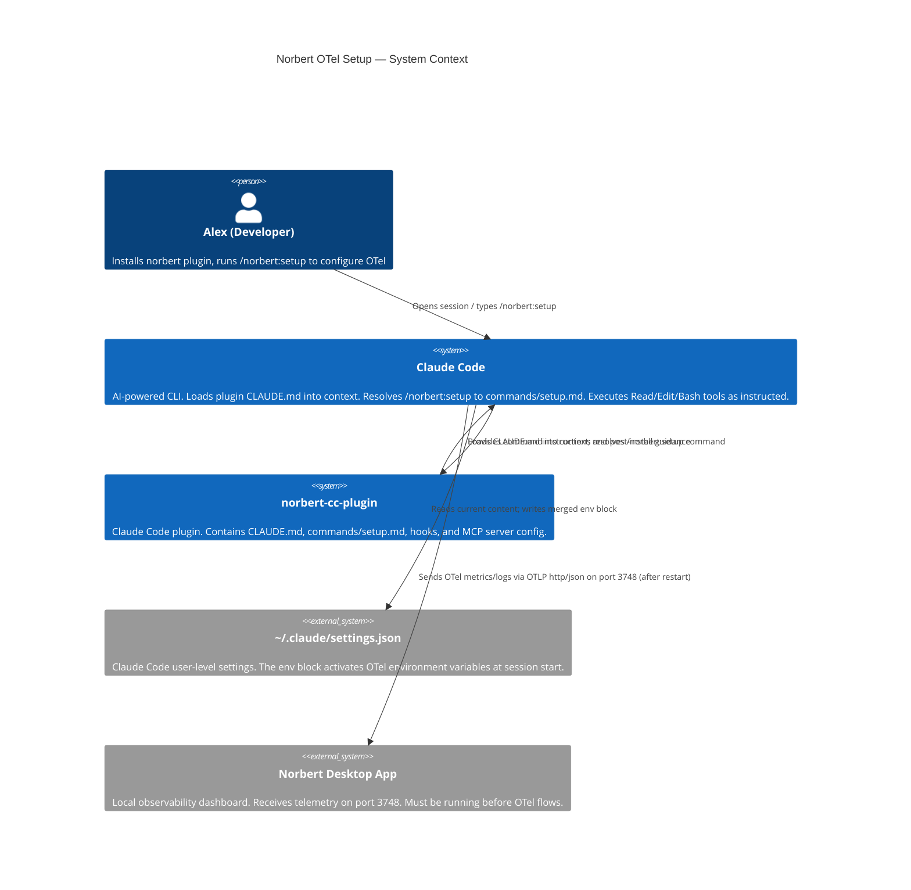
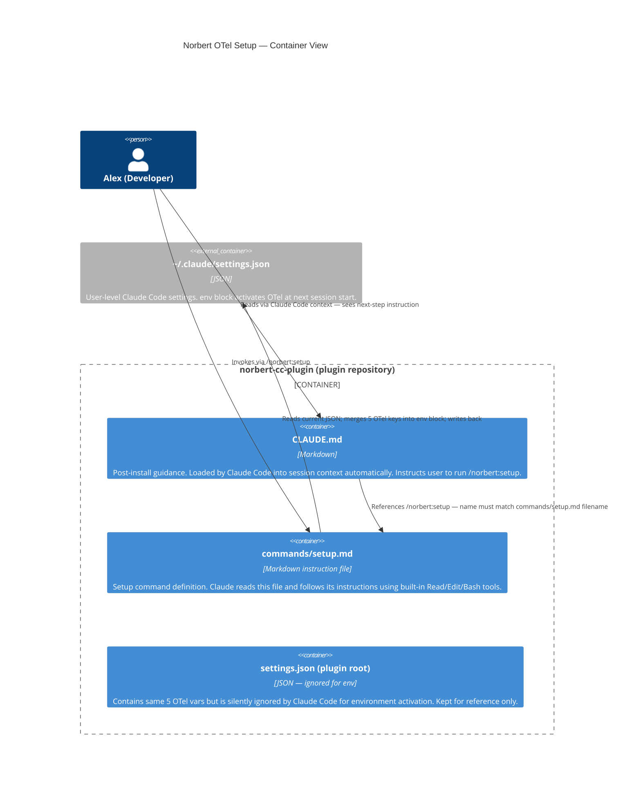

# Architecture Design — otel-setup-skill

Feature: Norbert OTel Setup Command and Post-Install Guidance
Feature ID: otel-setup-skill
Date: 2026-03-25
Author: Morgan (solution-architect)
Status: Approved for handoff

---

## System Context

The norbert-cc-plugin is a Claude Code plugin. Claude Code loads plugin content (CLAUDE.md, commands/) directly into the session context and resolves command invocations at runtime. There is no application server, no build step, and no deployment pipeline for this feature. Claude itself is the runtime for `/norbert:setup`.

The feature adds two artifacts to the plugin repository:

1. `commands/setup.md` — a Markdown instruction file that Claude reads and executes when the user types `/norbert:setup`
2. `CLAUDE.md` — a Markdown content file loaded automatically into every Claude Code session where the norbert plugin is active

A third concern — the plugin-local `settings.json` — requires a documentation note but no new artifact.

---

## C4 System Context (L1)

---

## C4 Container (L2)

---

## Key Architectural Decisions

### ADR-001: Command vs Skill (commands/setup.md)

The `/norbert:setup` function is a one-shot idempotent configuration command with no sub-steps, no persistent state, and no multi-turn interaction. A `commands/setup.md` file (simple command) is appropriate. A `skills/setup/SKILL.md` (agent skill) adds metadata overhead (description, tool restrictions, structured output) with no benefit for this use case. See ADR-001 for full decision record.

### ADR-002: CLAUDE.md at Plugin Root

Post-install messaging mechanism is CLAUDE.md at the plugin root. Confirmed supported by Claude Code plugin system. See ADR-002 for alternatives evaluated and rejected.

### ADR-003: Plugin-Local settings.json Disposition

The plugin-local `settings.json` contains the 5 OTel vars but they are silently ignored by Claude Code for environment activation. The file is NOT deleted — it may serve as documentation or future reference. A comment-like note is added to README to prevent the "wrong file" trap. See ADR-003.

---

## Component Architecture

### commands/setup.md

- **Location**: `commands/setup.md` (plugin-relative path — Claude Code resolves to `/norbert:setup`)
- **Runtime**: Claude Code reads this file when user types `/norbert:setup`; Claude executes the instructions using its built-in Read, Edit, and Bash tools
- **Responsibilities**:
  - Resolve `~` to the OS home directory
  - Read `~/.claude/settings.json` — bail with human-readable error if missing or malformed JSON
  - Compare each of the 5 OTel keys against canonical values
  - On all-correct: report idempotent success, no write
  - On any conflict (without --force): report per-key warning with current vs. intended value, no write
  - On no conflict (or --force): merge 5 keys into `env` block, preserve all other content, write back, confirm restart required
  - Support `$ARGUMENTS` to detect `--force` flag
- **Output contract**: prefix characters `+` (added), `=` (already correct), `!` (overwritten via --force)
- **Safety constraints**:
  - Never write on JSON parse failure
  - Never write on conflict (without --force)
  - Never replace `env` block wholesale — surgical per-key merge only
  - Mention Claude Code auto-backup in success output

### CLAUDE.md

- **Location**: plugin root (same level as `.claude-plugin/`, `hooks/`, `.mcp.json`)
- **Runtime**: Claude Code loads this file into session context automatically when plugin is enabled
- **Responsibilities**:
  - Identify Norbert and its purpose (one sentence)
  - State that OTel setup is required for full functionality
  - Provide the exact command: `/norbert:setup`
  - Note that Norbert must be running first
- **Constraints**: fewer than 10 lines of user-visible content; no full README reproduction; command name must match `commands/setup.md` filename exactly

---

## Technology Stack

No technology selection required. Deliverables are Markdown files. Claude Code and its built-in tools (Read, Edit, Bash) are the runtime — these are provided by the platform.

The 5 canonical OTel key-value pairs (from shared-artifacts-registry.md):

| Key | Value |
|-----|-------|
| `CLAUDE_CODE_ENABLE_TELEMETRY` | `1` |
| `OTEL_METRICS_EXPORTER` | `otlp` |
| `OTEL_LOGS_EXPORTER` | `otlp` |
| `OTEL_EXPORTER_OTLP_PROTOCOL` | `http/json` |
| `OTEL_EXPORTER_OTLP_ENDPOINT` | `http://127.0.0.1:3748` |

---

## Integration Patterns

### Command Invocation

Claude Code resolves `/norbert:setup` by matching the `norbert` plugin namespace and the `setup` filename within `commands/`. The `$ARGUMENTS` variable in the command Markdown receives the remainder of the user's input (e.g., `--force`). No API contracts — this is a text-instruction interface.

### Settings.json Merge Pattern

Read → Parse → Compare → Branch → (Write or Bail). All steps are synchronous. No locking required (single-user CLI context). The merge is additive-only on a clean run; `--force` replaces the 5 target keys only.

### CLAUDE.md Loading

Claude Code loads `CLAUDE.md` from the plugin root directory when the plugin is enabled. Content appears in every session context automatically. No registration or configuration required beyond file presence.

---

## Quality Attribute Strategies

| Attribute | Strategy |
|-----------|----------|
| Safety (data integrity) | Bail on malformed JSON. No write on conflict. Surgical merge preserves all non-target keys. |
| Idempotency | Compare before write. No-op when all 5 keys already correct. |
| Usability | Output prefix convention (`+`/`=`/`!`). Explicit restart reminder. Human-readable error messages. No stack traces. |
| Discoverability | CLAUDE.md in context — impossible to miss. References exact command name. |
| Maintainability | Command is a single Markdown file. No build, no dependencies. Update by editing one file. |
| Cross-platform | `~` expansion must be OS-aware. Command instructions must handle `$HOME` (Unix) and `%USERPROFILE%` (Windows). |

---

## Rejected Simple Alternatives

### Alternative 1: Ship the 5 vars in plugin settings.json only (current state)
- What: The plugin root `settings.json` already has all 5 OTel vars
- Expected impact: 0% — Claude Code silently ignores plugin-local `settings.json` env vars for environment activation
- Why insufficient: This is the exact bug the feature fixes; confirmed by official Claude Code plugin documentation

### Alternative 2: README instructions only
- What: Add a manual edit section to README.md with the 5 vars
- Expected impact: ~20% — users who read and follow README at install time
- Why insufficient: README is read once and forgotten; subsequent users (teammates, returning after time away) have no in-context reminder; manual editing has no validation safety net

### Why the command + CLAUDE.md approach is necessary
1. Simple alternatives fail because: (a) plugin settings.json env is non-functional for this purpose; (b) README is passive and lacks validation
2. Complexity justified by: one-command setup with conflict detection, idempotency, and safe-merge guarantees that simple alternatives cannot achieve

---

## Deployment Architecture

No deployment step. The plugin is installed via `/plugin install norbert@pmvanev-plugins`. Adding `commands/setup.md` and `CLAUDE.md` to the plugin repository root makes them available to all users on their next plugin update or reinstall. No CI pipeline changes required for the Markdown artifacts themselves.

README.md should be updated to document the `/norbert:setup` command and cross-reference the CLAUDE.md mechanism.
